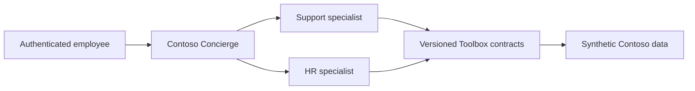

# Contoso Concierge

> **Repository status:** source and ALM contract only. No Copilot Studio
> environment, agent, channel, managed artifact, or tenant publication has been
> created.

Contoso Concierge is the front door for the specialist agents already described
by the shared [Toolbox contracts](../data/toolbox.md). It chooses a specialist
from the user's request, but it never chooses the user's identity or data scope.
The authenticated caller is resolved server-side from immutable identity claims,
and the selected specialist applies its existing role and row-scope contract.

## What is in source control

The tenant-neutral solution scaffold lives under
`solutions/ContosoConcierge/src/`, while the agent and topic contracts live
under `solutions/ContosoConcierge/spec/`. Together they pin solution version
`1.0.0.0`, declare the Support and HR specialist contracts, and include a
`/version` topic that returns the accepted version from the
`ccs_AcceptedVersion` environment variable. It never returns an environment
name, tenant identifier, or endpoint.

The synthetic delegation suite proves four repository-level expectations:

- a support request selects `support_lookup_case` with canonical case ID
  `CASE-00005`;
- the same roster request sent as the EMEA and APAC People Partner personas
  expects disjoint regional results;
- identity and scope are absent from specialist tool arguments; and
- an unknown synthetic principal fails before delegation and returns no rows.

These are contract tests, not screenshots or transcripts from a human session.
They reuse the canonical personas and tools from the [data
spine](../data/overview.md) and do not require a tenant or network connection.

## Solution lifecycle

Microsoft recommends solutions as the carrier for Copilot Studio agents and an
environment strategy that separates development, test, and production. The
Concierge follows that model: DEV is unmanaged source, while TEST and PROD
receive the same managed artifact. Target-specific values are supplied through
environment variables and connection references rather than committed in git.
See the [Concierge ALM runbook](../operations/concierge-alm.md).

Importing the managed solution is not permission to expose the runtime. An agent
owner must publish the agent manually, and a Microsoft 365 administrator must
separately approve tenant availability. Those gates stay manual because
authentication settings, channels, sharing, and Application Insights settings
aren't solution-aware in the Copilot Studio lifecycle.

## Limitations

- The actual exported Copilot Studio bot and bot-component files do not exist
  yet. Their component identifiers can only come from an authorized DEV export;
  the repository does not fabricate them.
- The custom connector and `ccs_FoundrySpecialist` connection-reference export
  are placeholders until the specialist gateway and DEV environment exist. The
  PAC smoke pack succeeds for the scaffold, but release readiness fails until an
  authorized export supplies those real components.
- Synthetic contract tests demonstrate expected delegation and persona
  isolation. A separate protected TEST harness must repeat those checks against
  the published runtime before a PROD-eligible artifact exists. Neither has run
  in the current blocked tenant state.
- No capacity has been observed. A forbidden capacity API response means
  capacity is unknown, not sufficient.
- Environment-level Application Insights export is **public preview**. It is
  restricted to synthetic DEV/TEST conversations and is disabled in PROD.
- No human-session screenshots, transcripts, KQL exports, or telemetry artifacts
  are part of the repository deliverable.

## First-party guidance

- [Copilot Studio ALM strategy](https://learn.microsoft.com/microsoft-copilot-studio/guidance/alm)
- [Create and manage solutions in Copilot Studio](https://learn.microsoft.com/microsoft-copilot-studio/authoring-solutions-overview)
- [Agent-level Application Insights telemetry](https://learn.microsoft.com/microsoft-copilot-studio/advanced-bot-framework-composer-capture-telemetry)
- [Environment-level telemetry (public preview)](https://learn.microsoft.com/microsoft-copilot-studio/advanced-environment-level-agent-telemetry)
- [Control transcript access and retention](https://learn.microsoft.com/microsoft-copilot-studio/admin-transcript-controls)
