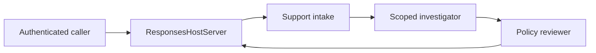

# Contoso Support hosted agent

Contoso Support is the production-representative **public preview** hosted-agent
slice. It demonstrates the deployment and security boundaries that matter in
production, but it is not described as production-ready because Microsoft
Foundry hosted agents are a preview service without an SLA.

## One endpoint, three agents

The public surface is one
[Responses protocol 2.0 endpoint](https://learn.microsoft.com/azure/foundry/agents/how-to/deploy-hosted-agent#container-requirements).
Inside the container, Microsoft Agent Framework executes a sequential workflow:



The intake agent classifies the request without inferring identity. The
investigator is the only agent with tools. The policy reviewer rejects
unsupported claims, hidden-scope inference and unapproved mutation before the
answer leaves the workflow. Agent Framework emits both agent and workflow
[OpenTelemetry spans](https://learn.microsoft.com/agent-framework/workflows/observability).

`ResponsesHostServer` uses Microsoft's protocol library rather than a custom
HTTP shim. The library owns `/responses`, `/readiness`, streaming, background
response lifecycle and cancellation, as described in the
[hosted-agent container contract](https://learn.microsoft.com/azure/foundry/agents/how-to/deploy-hosted-agent#responses-protocol-library).
There is no legacy `/invoke` route.

## Identity becomes scope only on the server

The endpoint requires Microsoft Entra authorization. AgentServer's ambient
request context supplies an opaque user identifier after the Foundry gateway
authenticates the request. The container does not trust that text as a role,
region or tenant:

1. `CONTOSO_PRINCIPAL_MAP_JSON` is stored as a write-only Foundry `CustomKeys`
   connection, not in source or a visible version environment value.
2. A frozen allow-list maps the platform identifier to one canonical synthetic
   object key.
3. The existing `IdentityResolver` maps that key to immutable roles and regions.
4. The existing `ScopedRepository` injects mandatory row predicates before SQL
   executes.
5. A fresh Toolbox and SQLite connection are created for every tool call.

Missing, malformed, unknown and forged identifiers all raise the same
fail-closed error. Responses 2.0's opaque per-request `call_id` is required
alongside the mapped `user_id`. Identity is held in request-local context; no
process-global principal can leak between concurrent EMEA and APAC requests.
Tool schemas do not accept identity, tenant, role, region or scope.

This design depends on the authenticated Foundry endpoint. A directly exposed
container would make a caller-supplied identity header untrustworthy, so the
binding also requires platform-injected hosted-agent context and rejects direct
invocation. Microsoft's
[hosted Agent Framework guidance](https://learn.microsoft.com/azure/foundry/how-to/develop/framework-hosted-agents)
is the authority for that request context.

## Deployment boundary

The unified [`azure.yaml`
contract](https://learn.microsoft.com/azure/foundry/agents/concepts/azure-yaml-reference)
connects to the owned `support` project, declares Responses 2.0 and uses the
repository Bicep instead of synthesizing another resource group.

The image is built for `linux/amd64`, pushed to the project-owned Premium Azure
Container Registry, and pulled through a private endpoint. Public registry
access is disabled. Microsoft documents private-registry support only for
projects created after June 25, 2026; deployments must keep using an eligible
project. `azd deploy` creates the per-agent identity and grants only `AcrPull`
on that registry, following the
[private ACR workflow](https://learn.microsoft.com/azure/foundry/agents/how-to/deploy-hosted-agent-private-azure-container-registry)
and [hosted-agent permission model](https://learn.microsoft.com/azure/foundry/agents/concepts/hosted-agent-permissions).

An ACR with public access disabled can be built only from inside its virtual
network. The manual deployment workflow therefore requires a self-hosted runner
labelled `contoso-agents-vnet`; it never falls back to a public registry. All
provisioning is preceded by the live ownership-boundary gate, so every mutation
remains inside the owned resource group.

## Evidence gates

The model-free evaluation uses the canonical generated database and the real
Toolbox contracts:

```bash
foundry data verify --out data/build
foundry toolbox validate
foundry support evaluate
```

It proves a visible AMER lookup, a hidden APAC lookup, EMEA/APAC isolation across
sequential requests and an unknown-principal denial. Dependency, data and
expectation failures exit non-zero rather than producing a partial pass.

CI also builds the exact container and polls `/readiness`. The protected live
workflow then invokes `/responses` without supplying an identity header, checks
a visible and hidden synthetic case, and queries shared Application Insights
for GenAI spans whose `OTEL_SERVICE_NAME` is `contoso-support`. Sensitive prompt
and completion capture is disabled.

After deployment, the following check reads the Foundry data-plane API and
fails unless the exact version is active, exposes Responses 2.0 and is the only
`FixedRatio` route at 100 percent:

```bash
foundry support verify-deployment \
  --project-endpoint "$AZURE_AI_PROJECT_ENDPOINT" \
  --version "$AGENT_CONTOSO_SUPPORT_VERSION"
```

Foundry supports exactly one version at 100 percent rather than traffic
splitting; see
[hosted-agent endpoint routing](https://learn.microsoft.com/azure/foundry/agents/how-to/manage-hosted-agent#configure-agent-endpoint-routing).

## Honest limitations and cost

The canonical SQLite database is generated while the image is built, hashed,
packaged under a root-owned path and opened in immutable read-only mode. The
runtime verifies the digest before every tool connection. The hosted surface
exposes only support, customer and catalogue reads; the shared Toolbox write
contract remains unavailable. This demonstrates row-level authorization, not a
durable case-management store.

The [cost model](../platform/costs.md) adds live Retail Prices API meters for the
Premium registry, private endpoint, private DNS and planned `gpt-5.4-mini`
tokens. Hosted-agent CPU and memory have no unambiguous retail meter, so the
model holds a non-zero pilot reserve rather than claiming that compute is free.
