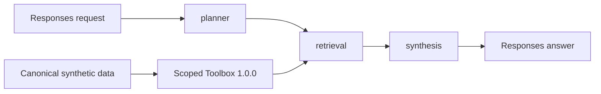

# Contoso Research

Contoso Research is a production-representative LangGraph hosted agent over the
repository's canonical synthetic company data. It answers bounded operational
questions without granting a model direct database access or allowing a request
to choose its own identity scope.

!!! warning "Public preview"
    Microsoft Foundry hosted agents and parts of the unified `azure.yaml`
    deployment surface are public preview. The implementation exercises the
    current contract, but preview limitations still apply.

## Transparent workflow



The compiled graph keeps these fields visible after every node:

- `question` — normalized user question;
- `plan` — exact Toolbox calls and arguments;
- `evidence` — synthetic records returned by those calls;
- `audit` — tool, persona, argument names, and result counts;
- `answer` and `messages` — the evidence-bound synthesis result.

Planning is deterministic and bounded to customer, order, invoice, product, and
stock questions. Retrieval uses the shared Toolbox with one trusted persona
route, currently `americas-supply-planner`. The model cannot change that route,
call SQLite directly, or invent a new capability. Synthesis receives only the
question and retrieved evidence; an empty model response is an error.

## Exact contracts and routing

The deployment pins four independent versions:

| Contract | Version |
| --- | --- |
| Agent behavior | `1.0.0` |
| Hosted agent version | `1` |
| Responses protocol | `2.0.0` |
| Toolbox capabilities | `1.0.0` |
| Model | `gpt-5.4-mini`, `2026-03-17`, Global Standard |

The Entra-authorized endpoint sends 100% of traffic to hosted version `1`; it
does not use `@latest`. At startup the container compares the platform-injected
agent name and version with that route and exits on a mismatch. The canonical
data lock and every Toolbox contract version are verified before the graph is
served.

## Runtime and identity

The root `Dockerfile` is the deployable image. The current
[Responses protocol](https://learn.microsoft.com/azure/foundry/agents/concepts/hosted-agents#protocols-responses-invocations-and-invocations-websocket)
provides conversation history, streaming lifecycle, background execution,
health, and cancellation handling; this agent does not implement a legacy
`/invoke` endpoint.

The unified `azure.yaml` connects to the existing Research project and confines
deployment to `rg-contoso-agents`. It declares the exact model deployment,
container resources, endpoint authorization, and version route. The Foundry
platform creates a dedicated agent identity. Any future downstream role must be
assigned only after that identity exists, following the
[hosted-agent permissions reference](https://learn.microsoft.com/azure/foundry/agents/concepts/hosted-agent-permissions),
and never above the project-owned resource group.

The project can use a
[private Azure Container Registry](https://learn.microsoft.com/azure/foundry/agents/how-to/deploy-hosted-agent-private-azure-container-registry).
Nothing in this slice enables anonymous access or weakens the registry network
posture.

## Telemetry

`AzureAIOpenTelemetryTracer` traces all graph nodes to the Research project's
shared Application Insights connection. The service name and agent identifier
are both `contoso-research`, producing the expected OpenTelemetry generative-AI
agent attributes. Content recording is disabled; node timing, tool failures,
and standard operational attributes remain available.

See [one telemetry spine](../platform/telemetry-spine.md) for the shared
monitoring design.

## Evaluations and failure behavior

`config/research-evals.yaml` contains deterministic synthetic goldens for:

1. overdue receivables;
2. outstanding receivables;
3. stock availability.

The evaluator checks the agent, hosted route, protocol, persona, plan, row
counts, and answer conditions. Unknown routes, wrong versions, data-lock drift,
contract drift, unsupported questions, tool failures, and empty synthesis all
fail closed. Tests mock model synthesis and need neither Azure credentials nor
network access.

Run the local gates from the branch-local environment:

```powershell
$env:PYTHONPATH = "src"
.\.venv\Scripts\python -m contoso_foundry.research.evaluate
.\.venv\Scripts\python -m pytest tests\test_research.py
docker build --tag contoso-research:local .
```

## Deployment sequence

The deployment uses the current unified configuration rather than legacy split
agent manifests:

```powershell
azd env set CONTOSO_RESEARCH_PROJECT_ENDPOINT <research-project-endpoint>
azd deploy contoso-research
azd ai agent show contoso-research
```

The endpoint value is an environment input and must not be committed. After
deployment, smoke tests must call the protocol-specific Responses endpoint for
hosted version `1` and use only synthetic prompts from the golden suite. Any
provisioning, API, evaluation, or smoke failure blocks promotion.
