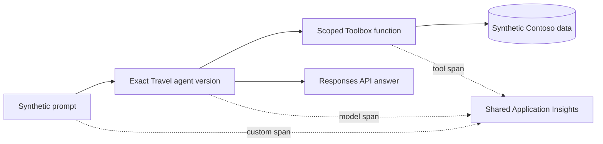

# Contoso Travel prompt agent

This deployable demonstration uses synthetic data only and makes no claim about
current live deployment state.

| Agent card | Value |
| --- | --- |
| Definition | Code-defined modern Foundry prompt agent |
| Model | `gpt-5.4-mini`, exact version `2026-03-17` |
| Deployment | Global Standard, no automatic model upgrade |
| Tools | Travel routes, fares, policy, booking simulation, and scoped bookings |
| Identity | Synthetic principal resolved on the server |
| Writes | None; booking is a simulation |
| Telemetry service | `contoso-travel` |

The agent is created with `PromptAgentDefinition` and `create_version`. Calls use
the Responses API and name an exact agent version. There is no "first agent"
lookup and no fallback candidate. Microsoft documents this versioned prompt-agent
pattern in the [prompt agent quickstart][prompt-agent].



## Scope cannot come from the prompt

The runtime binds the fixture principal before exposing any tool. Tool schemas do
not contain tenant, principal, role, scope, or region-override parameters, and
unexpected parameters fail before a tool runs. The Toolbox resolves the caller's
regions and roles from immutable identity keys. A model can choose a business
filter; it cannot choose whose rows it reads.

## Synthetic traffic

The Container Apps Job is deployed with its maintenance switch **off**. When an
operator enables it, the UTC schedule wakes on Travel's two allocated half-hour
slots and the application applies an `America/Chicago` calendar:

- weekdays run only during 08:00-18:00 local business hours;
- weekends and all eleven US federal holidays, including observed dates, use two
  quiet daytime slots;
- a Blob Storage claim permits one conversation per quarter hour across all job
  replicas and manual runs, enforcing an estate-wide maximum of four per hour;
- Travel can claim only two configured quarter-hour slots per hour, preserving
  the other half of the estate capacity for Support, Research, and Field traffic;
- every persona, prompt, route, fare, and policy is checked-in synthetic data.

The image uses the estate's shared Basic container registry. Gateway/platform
owns that single registry cost, so Travel does not count it a second time.

Container Apps evaluates schedules in UTC, so the calendar belongs in application
code where daylight-saving changes can be tested. See [scheduled jobs][jobs].

## Evaluation and promotion

Promotion is candidate-first:

1. create one immutable agent version and persist its name, version, model version,
   and definition digest under the non-published `internal/` path;
2. invoke that exact version with the golden JSONL;
3. require correct Toolbox calls and deterministic task and safety checks;
4. submit the captured outputs to the real eval API, poll to a terminal state, and
   require every quality, safety, task, and tool criterion to pass;
5. only then place that version and an exact image digest in the disabled job.

The verified manual API path is:

```powershell
$env:PYTHONPATH = "src;agents\travel\src"
$env:FOUNDRY_PROJECT_ENDPOINT = "<runtime project endpoint>"
python -m contoso_travel_agent.operations deploy
python -m contoso_travel_agent.operations smoke
python -m contoso_travel_agent.operations evaluate
```

The current OpenAI eval client exposes create, run, list, retrieve, and output-item
operations, but no continuous schedule or intelligent-sampling configuration.
Until that API surface exists, CI and the runbook execute the fixed golden set on
each exact candidate. Raw per-sample output stays under `internal/`.

`evals/azure.eval.yaml` also declares a trace-sourced discovery evaluation. The
current public-preview `azd ai eval` contract can filter traces by agent name but
cannot pin an immutable prompt-agent version, so this signal must not promote a
candidate or replace the fixed regression set. An operator can register and run
it against the known project endpoint:

```powershell
azd extension install azure.ai.evaluations
azd ai eval create --project-endpoint $env:FOUNDRY_PROJECT_ENDPOINT
azd ai eval run start --eval contoso-travel-trace-discovery `
  --project-endpoint $env:FOUNDRY_PROJECT_ENDPOINT `
  --fail-on any-failure
azd ai eval run output list --eval contoso-travel-trace-discovery `
  --project-endpoint $env:FOUNDRY_PROJECT_ENDPOINT `
  --output-file internal/travel/trace-eval-output.json
```

The explicit `--fail-on` is required because a completed run can contain failing
samples while exiting successfully; see [continuous evaluation guidance][evaluation].

## Preview and evidence limits

Foundry agent and evaluation APIs can evolve. Exact SDK, model, and API versions
are pinned so a preview change fails visibly. Live identifiers, endpoints, raw
eval items, and trace IDs stay under `internal/` and are never published. Any
public screenshot must be generated from the same synthetic prompts and must pass
the site scanner.

[prompt-agent]: https://learn.microsoft.com/azure/foundry/agents/quickstarts/prompt-agent
[jobs]: https://learn.microsoft.com/azure/container-apps/jobs
[evaluation]: https://learn.microsoft.com/azure/foundry/observability/how-to/azure-developer-cli-evaluation
