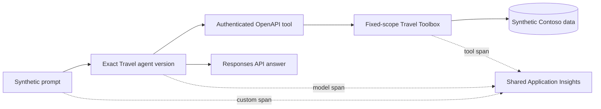

# Contoso Travel prompt agent

This deployable demonstration uses synthetic data only and makes no claim about
current live deployment state.

| Agent card | Value |
| --- | --- |
| Definition | Code-defined modern Foundry prompt agent |
| Model | `gpt-5.4-mini`, exact version `2026-03-17` |
| Deployment | Global Standard, no automatic model upgrade |
| Tools | Authenticated OpenAPI routes, fares, policy, and booking simulation |
| Identity | Synthetic principal resolved on the server |
| Writes | None; booking is a simulation |
| Telemetry service | `contoso-travel` |

The agent is created with `PromptAgentDefinition`, a typed `OpenApiTool`, and
`create_version`. Foundry executes the four HTTPS operations server-side and
supplies their API key from a project connection; the key is not part of the
agent definition. Calls use the Responses API and name an exact agent version.
There is no "first agent" lookup and no fallback candidate. Microsoft documents
the versioned [prompt-agent pattern][prompt-agent] and [OpenAPI authentication
contract][openapi-tool].



## Scope cannot come from the prompt

The runtime binds the fixture principal before exposing any tool. Tool schemas do
not contain tenant, principal, role, scope, or region-override parameters, and
unexpected parameters fail before a tool runs. The Toolbox resolves the caller's
regions and roles from immutable identity keys. A model can choose a business
filter; it cannot choose whose rows it reads.

## Foundry Playground demo

Open the `travel` project in Foundry, select the newest immutable
`contoso-travel` version, and send:

> Find the synthetic route from LOC-001 (Contoso Seattle Headquarters) to
> LOC-002 (Contoso Chicago Distribution).

The Playground completes the turn autonomously and cites `ROUTE-0001`. It does
not pause for **Enter function output as JSON** because the agent contains one
server-executed OpenAPI tool rather than client-executed function definitions.
The same browser flow supports:

- `What synthetic travel policy applies to me?`
- `Find the published synthetic fares on ROUTE-0001.`
- `First use travel_search_fares to read the published synthetic fares on ROUTE-0001. Then simulate, but do not purchase, the first returned fare for 2026-09-15.`

The final prompt is a simulation only. The service exposes no purchase operation
and does not expose the scoped bookings-list operation.

Raw `FunctionTool` definitions are a different integration path. The SDK or CLI
client that submits such a definition must inspect each function call, execute
the Toolbox locally, and return function output in a callback loop. Older agent
versions using that contract therefore are not browser-demo candidates. The
checked-in callback runtime remains for SDK/CLI examples, while the browser-facing
definition is regression-tested to permit only typed `OpenApiTool` transport.

## Synthetic traffic

The Container Apps Job is deployed with its maintenance switch **off**. When an
operator enables it, the UTC schedule wakes on Travel's two allocated half-hour
slots and the application applies an `America/Chicago` calendar:

- weekdays run only during 08:00-18:00 local business hours;
- weekends and all eleven US federal holidays, including observed dates, use two
  quiet daytime slots;
- the scheduled job uses one replica and one execution at each configured slot,
  while each trace records the deterministic local-time slot for audit;
- Travel can claim only two configured quarter-hour slots per hour, preserving
  the other half of the estate capacity for Support, Research, and Field traffic;
- every persona, prompt, route, fare, and policy is checked-in synthetic data.

The image uses the estate's shared Basic container registry. Gateway/platform
owns that single registry cost, so Travel does not count it a second time.

Container Apps evaluates schedules in UTC, so the calendar belongs in application
code where daylight-saving changes can be tested. See [scheduled jobs][jobs].

## Evaluation and promotion

Promotion is candidate-first:

1. deploy a backend and project connection whose release name is bound to the
   agent definition major version while retaining the previous release during
   candidate verification;
2. authenticate directly to all four operations and require deterministic evidence;
3. create one immutable agent version and persist its name, version, model version,
   and definition digest under the non-published `internal/` path;
4. invoke that exact version with the golden JSONL and verify the completed OpenAPI
   calls and arguments returned in Responses API metadata;
5. submit the captured outputs to the real eval API, poll to a terminal state, and
   require every quality, safety, task, and tool criterion to pass;
6. remove the superseded backend, connection, identity, and exact least-privilege
   roles so the live boundary again contains one active release;
7. place the accepted version and exact image digest in the disabled job without
   redeploying the validated backend.

Re-running an existing release is refused because changing its image would alter
previous agent versions. Credential rotation is an explicit exception: it preserves
the live image and updates only the backend secret and project connection.

The verified manual API path is:

```powershell
$env:PYTHONPATH = "src;agents\travel\src"
$env:FOUNDRY_PROJECT_ENDPOINT = "<runtime project endpoint>"
python -m contoso_travel_agent.operations deploy
python -m contoso_travel_agent.operations smoke
python -m contoso_travel_agent.operations evaluate
```

The current OpenAI eval client exposes create, run, list, retrieve, and output-item
operations, but no continuous schedule or intelligent-sampling configuration.
Until that API surface exists, CI and the runbook execute the fixed golden set on
each exact candidate. Raw per-sample output stays under `internal/`.

`evals/azure.eval.yaml` also declares a trace-sourced discovery evaluation. The
current public-preview `azd ai eval` contract can filter traces by agent name but
cannot pin an immutable prompt-agent version, so this signal must not promote a
candidate or replace the fixed regression set. An operator can register and run
it against the known project endpoint:

```powershell
azd extension install azure.ai.evaluations
azd ai eval create --project-endpoint $env:FOUNDRY_PROJECT_ENDPOINT
azd ai eval run start --eval contoso-travel-trace-discovery `
  --project-endpoint $env:FOUNDRY_PROJECT_ENDPOINT `
  --fail-on any-failure
azd ai eval run output list --eval contoso-travel-trace-discovery `
  --project-endpoint $env:FOUNDRY_PROJECT_ENDPOINT `
  --output-file internal/travel/trace-eval-output.json
```

The explicit `--fail-on` is required because a completed run can contain failing
samples while exiting successfully; see [continuous evaluation guidance][evaluation].

## Preview and evidence limits

Foundry agent and evaluation APIs can evolve. Exact SDK, model, and API versions
are pinned so a preview change fails visibly. Live identifiers, endpoints, raw
eval items, and trace IDs stay under `internal/` and are never published. Any
public screenshot must be generated from the same synthetic prompts and must pass
the site scanner.

[prompt-agent]: https://learn.microsoft.com/azure/foundry/agents/quickstarts/prompt-agent
[openapi-tool]: https://learn.microsoft.com/azure/foundry/agents/how-to/tools/openapi
[jobs]: https://learn.microsoft.com/azure/container-apps/jobs
[evaluation]: https://learn.microsoft.com/azure/foundry/observability/how-to/azure-developer-cli-evaluation
