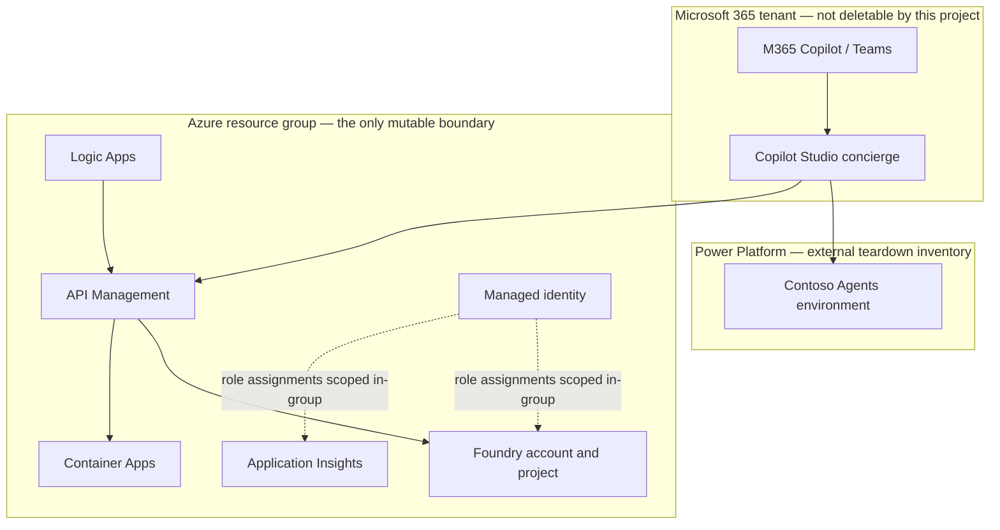

# Architecture overview

## Design constraints

The architecture is shaped by four constraints, in priority order.

1. **People should not have to go anywhere new.** Adoption of an internal agent
   platform is dominated by whether it appears where people already work. So the
   entry point is Microsoft 365 Copilot and Teams, not a new web app.
2. **Governance happens once.** Authentication, throttling and audit are
   properties of the platform, not of each agent. An agent author should not be
   able to accidentally ship an ungoverned endpoint.
3. **The whole thing is deletable.** A demo that cannot be removed cleanly is a
   liability. Everything created lives in one resource group.
4. **It fits a fixed budget.** $500/month of incremental Azure spend, verified
   mechanically rather than estimated optimistically.

## Layers

### Front door — Copilot Studio

A single concierge agent, pinned tenant-wide, is the only thing most people
interact with. It classifies the request and calls the appropriate specialist.

This layer is deliberately thin. It holds routing and conversation, not business
logic, because Copilot Studio bills per interaction in
[Copilot Credits](https://learn.microsoft.com/microsoft-copilot-studio/requirements-messages-management)
and that meter is separate from the Azure budget. Keeping heavy reasoning on the
Azure side keeps the two cost models independent and legible.

!!! warning "Blocked until capacity is verified"
    Tenant-wide publication is gated on confirming Copilot Credit capacity in the
    Power Platform admin centre. See [Cost model](../platform/costs.md).

### Gateway — API Management Basic v2

Every call between layers traverses
[API Management](https://learn.microsoft.com/azure/api-management/api-management-key-concepts).

Basic v2 is chosen as the cheapest v2 tier carrying an SLA. Its region
availability is narrower than API Management's own, which is why region selection
tests it explicitly rather than trusting the resource provider's location list.

The gateway is what makes constraint 2 true: an agent is reachable only through
a policy-enforced route, so rate limiting and request logging cannot be skipped
by an individual agent author.

### Reasoning — Foundry Agent Service

Specialist agents run on the
[Foundry Agent Service](https://learn.microsoft.com/azure/foundry/agents/overview),
which is generally available and supplies threads, tool calling and evaluation.

Using the managed service rather than a hand-rolled orchestration loop means
there is no per-agent-hour runtime charge and no bespoke state store to operate.

### Autonomous work — Logic Apps agent loops

Work that should happen without anyone asking runs as
[Logic Apps agentic workflows](https://learn.microsoft.com/azure/logic-apps/agent-workflows-concepts).

!!! warning "Public preview"
    Consumption autonomous agentic workflows are in public preview. Microsoft
    publishes no region table for them; availability follows Foundry model
    availability in the same region, which is how region selection models the
    dependency.

These workflows call agents through the same gateway as interactive traffic, so
scheduled work is governed identically. Their token consumption is metered
separately from model inference and is priced in the cost model.

### Operations — Application Insights and Azure SRE Agent

Telemetry lands in a workspace-based Application Insights instance owned by this
project. [Azure SRE Agent](https://learn.microsoft.com/azure/sre-agent/overview)
watches the platform itself.

!!! note "No published price"
    SRE Agent bills in Azure Agent Units. Microsoft publishes the AAU consumption
    rates but not a USD conversion, and the Retail Prices API returns no SRE Agent
    meter. The cost model therefore holds an explicit budget reserve rather than
    recording it as free.

## Trust boundaries

Two boundaries matter:

- **Inside the resource group** — created, changed and deleted by this project.
  Every role assignment is scoped in-group; none is granted at subscription or
  management-group level.
- **Outside it** — the Microsoft 365 tenant and Power Platform. These are shared
  with everyone else in the tenant, so this project reads them, documents them,
  and never mutates them from automation. They are listed in an explicit external
  teardown inventory because deleting the resource group will not remove them.

See [Ownership boundary](../platform/boundaries.md) for the machine-checked
version of this diagram.

## What the current platform slice delivers

The deployment now includes the shared telemetry spine plus two additional
[Control Plane platform types](https://learn.microsoft.com/azure/foundry/control-plane/how-to-manage-agents):
a review-only Azure SRE Agent and a public-preview Logic Apps agent loop. Static
and live inventory checks keep their identity, ownership, and safety contracts
machine-verifiable.
