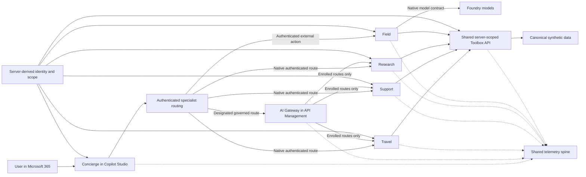
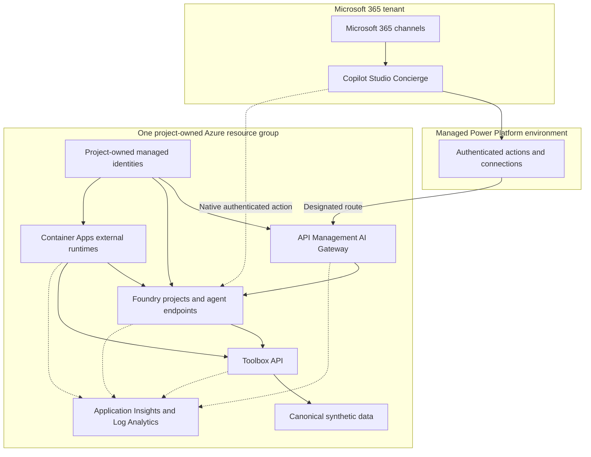

# Architecture overview

The Contoso Foundry platform is a reference design for composing specialized
agents around shared enterprise data, tools, identity, telemetry, and governed
model access. It separates durable platform contracts from the frameworks and
hosting models used by individual agents, so each workload can evolve without
creating a second data plane or bypassing the platform's security boundaries.

## Design principles

1. **Meet people in their flow of work.** Microsoft 365 and Copilot Studio are
   the conversational front door; specialist agents are reached through explicit
   topics, actions, and authenticated service contracts.
2. **Derive identity and scope on the server.** Callers do not choose customers,
   regions, or permissions in prompts. The platform resolves them from trusted
   claims and applies the same policy before every tool call.
3. **Govern deliberate ingress paths.** API Management is the governed ingress
   for model and custom-agent routes intentionally placed behind the AI Gateway.
   Native Foundry endpoints and external runtimes keep their own documented
   authentication and network boundaries.
4. **Share platform capabilities, not agent state.** Agents reuse canonical data,
   Toolbox tools, telemetry, model connections, and policy while keeping
   role-specific prompts, orchestration, and evaluation suites.
5. **Keep cost observable, attributable, and configurable.** Shared, fixed, and
   variable consumption is metered separately. Environment-specific limits are
   policy-as-code rather than permanent properties of the architecture.
6. **Constrain the Azure blast radius.** Mutable Azure resources belong to one
   declared resource group. Resources outside that boundary are read-only.

## Core request, data, and telemetry flows

The diagram distinguishes governance from reachability. Traffic crosses API
Management only when a route is intentionally enrolled in the [AI
Gateway](../platform/ai-gateway.md). Travel, Support, and Research retain native
Foundry endpoint contracts, while the [Field Agent](../agents/field.md) runs in
Container Apps and uses native Foundry model contracts. Gateway policy therefore
governs designated routes without becoming a universal network dependency.

## Shared data, tools, and identity

The [deterministic synthetic data model](../data/overview.md) is the canonical
business dataset. It gives every agent the same customer, order, inventory,
shipment, support, and market facts while keeping the public repository free of
real personal or tenant data.

Agents access that data through the
[Toolbox contract](../data/toolbox.md), not through agent-specific database
queries. Toolbox validates typed inputs, applies server-derived tenant, user, and
customer scope, and returns bounded results. This creates one place to enforce
authorization, audit tool use, and test cross-agent consistency.

The shared identity contract treats transport identity as evidence, not prompt
text. Each hosting surface maps its trusted claims into the same principal and
scope contract before invoking Toolbox or a governed route. Toolbox and each
agent page document the transport-specific mapping.

## Agent framework and hosting taxonomy

Framework choice and hosting choice are independent. A framework determines how
an agent plans and orchestrates work; a hosting surface determines lifecycle,
identity, networking, and billing.

| Hosting model | Platform contract | Representative role |
| --- | --- | --- |
| Prompt agent | Stable [Foundry Agent Service](https://learn.microsoft.com/azure/foundry/agents/overview) runtime with platform-managed threads, tools, and native endpoints | [Travel](../agents/travel.md) |
| Hosted agent | **Public preview** [Foundry hosted-agent deployment](https://learn.microsoft.com/azure/foundry/agents/concepts/hosted-agents) for code-based frameworks | [Support](../agents/contoso-support.md) with Microsoft Agent Framework and [Research](../agents/research.md) with LangGraph |
| External agent | **Public preview** [Foundry external-agent registration](https://learn.microsoft.com/azure/foundry/agents/how-to/register-external-agent) describing a runtime hosted outside Foundry; registration metadata is not a proxy or invocation path | [Field](../agents/field.md) with Pydantic AI on Container Apps |
| Copilot Studio agent | [Power Platform-managed conversational agent](https://learn.microsoft.com/microsoft-copilot-studio/fundamentals-what-is-copilot-studio) and Microsoft 365 channel integration | [Concierge](../agents/concierge.md) |

This taxonomy keeps preview labels precise. The prompt-agent service is a stable
platform capability; hosted-agent deployment and external-agent registration
remain public-preview capabilities even when the agent framework itself is
stable.

## Eight agent roles

The durable roster counts business and operational responsibilities, not worker
processes or framework nodes.

| Role | Architectural responsibility | Module |
| --- | --- | --- |
| Concierge | Conversational front door, intent routing, consent, and bounded delegation | Core entry point |
| Travel | Policy-grounded travel planning on the stable prompt-agent service | Specialist |
| Support | Scoped case investigation using an Agent Framework hosted workflow | Specialist |
| HR | Scoped people-policy and roster tools exposed through the Concierge and Toolbox contract | Contract specialist |
| Research | Multi-step evidence retrieval and synthesis using LangGraph | Specialist |
| Field | Work-order assistance from an external Container Apps runtime | Specialist |
| Approvals | Resumable human approval through a public-preview Logic Apps agent workflow | Optional platform coverage |
| SRE | Review-oriented operational investigation through Azure SRE Agent | Optional platform coverage |

All eight roles share the same data, Toolbox, identity, telemetry, and cost
attribution principles. A role can remain contract-only or use an optional
hosting surface without changing those platform contracts.

## AI Gateway

The [AI Gateway](../platform/ai-gateway.md) is a shared governance layer for designated
model and custom-agent traffic. API Management can enforce authentication,
request and token limits, schema validation, content-safety policy, correlation,
and audit logging before forwarding an approved route.

Gateway policy is route-specific. It does not replace native Foundry endpoint
authentication, Toolbox authorization, or the network controls of an external
runtime. A workload that needs gateway governance opts into the documented APIM
contract; a workload that uses a native platform path remains governed by that
platform's identity and authorization model.

## One telemetry spine

The [telemetry spine](../platform/telemetry-spine.md) propagates a correlation
identifier across conversational entry points, Gateway requests, specialist
agents, and Toolbox calls. Shared Application Insights and Log Analytics
resources provide end-to-end traces while role-specific attributes preserve
cost and reliability attribution.

Telemetry is diagnostic evidence, not an authorization source. Logs are
sanitized before publication, diagnostic destinations must be owned by the
declared resource group, and deployment validation rejects undeclared logging
targets.

## Trust boundaries

The tenant, Power Platform environment, and Azure resource group are separate
administrative boundaries. Connections crossing them require explicit identity,
least-privilege authorization, and an auditable contract. The Azure ownership
boundary forbids mutation outside the project resource group and prevents
diagnostics from being written to workspaces the project does not own.

## Core and optional modules

The core platform contracts are the canonical data model, Toolbox API,
server-derived identity, Foundry projects and model connections, the telemetry
spine, ownership enforcement, and route-specific Gateway policy. Agent runtimes
compose those capabilities according to their role; they do not redefine them.

### Optional platform coverage

Two modules broaden the Control Plane demonstration without becoming
dependencies of the agent platform:

- [Logic Apps Approvals](../operations/control-plane-coverage.md) demonstrates durable
  human approval, resumable orchestration, and connector governance. A workflow
  may call a designated Gateway route, but no core request path depends on Logic
  Apps.
- [Azure SRE Agent](../agents/contoso-sre.md) demonstrates operations
  investigation and remediation planning against project-owned resources. It is
  an optional operational workload, not a prerequisite for deployment,
  telemetry, or agent reachability.

Alternative hosting demonstrations, such as
[Field on AKS](../agents/field.md#alternative-aks-hosting), are also optional. They reuse the same
identity, Toolbox, telemetry, and model contracts rather than creating a parallel
platform.

## Continue through the durable design

1. [Data model](../data/overview.md) and
   [Toolbox](../data/toolbox.md) define shared business truth and tool contracts.
2. [Toolbox identity rules](../data/toolbox.md) explain how server-derived scope
   protects every tool call.
3. [AI Gateway](../platform/ai-gateway.md) documents designated governed ingress.
4. [Agent pages](../agents/concierge.md) describe role-specific framework and
   hosting choices.
5. [Telemetry spine](../platform/telemetry-spine.md) and
   [cost methodology](../platform/costs.md) explain operational attribution.
6. [Verification](../operations/verification.md) defines the checks that protect
   these contracts.
