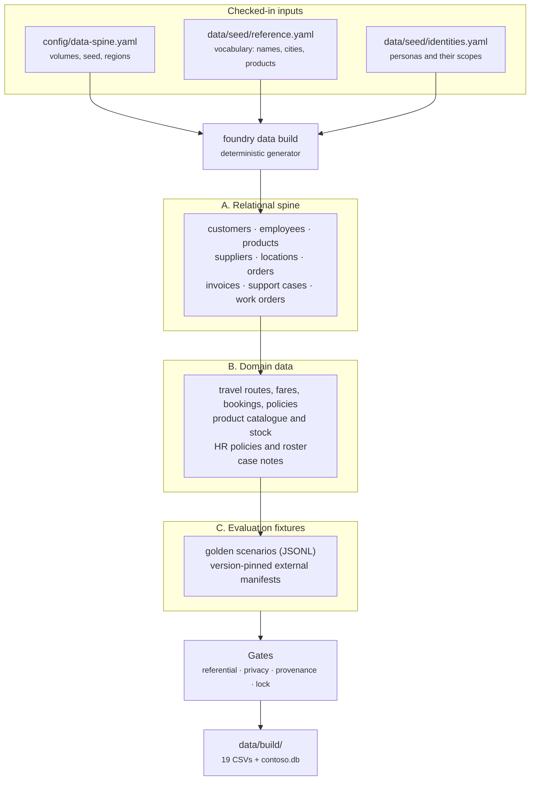

# The shared data spine

Eight agents that each invent their own idea of a customer are eight products.
The spine is what makes them one company: a single set of canonical identifiers
that every agent resolves the same way, so a travel agent and a support agent
talking about `CUST-00042` are talking about the same person.

!!! info "It is entirely synthetic"
    Contoso is fictitious. Every name, address, itinerary and support case on
    this page was generated from a checked-in seed. There is no real personal
    data anywhere in the dataset, and the build refuses to publish if a gate
    thinks otherwise.

## Three layers



**A. The relational spine** is modelled on the concepts in Microsoft's
MIT-licensed [Wide World Importers](https://github.com/microsoft/sql-server-samples/tree/master/samples/databases/wide-world-importers)
sample — customers buy products from suppliers, shipped from locations, billed on
invoices — but it is not a copy. Wide World Importers ships as SQL Server backup
files measured in hundreds of megabytes. This spine is generated code producing a
few hundred kilobytes of CSV and a SQLite file, so it clones and runs offline in
seconds with no database server.

**B. The domain data** hangs off those identifiers. A travel booking references
an employee; a support case references a customer and the employee handling it; a
stock level references a product and a location. Nothing floats free.

**C. The fixtures** are the small golden scenarios agents get evaluated against.
Where a public benchmark would be useful but its licence does not permit
redistribution, the repository stores a **version-pinned fetch manifest** rather
than the data. See [Provenance and licensing](provenance.md).

## What is in it

| Table | Rows | Canonical id |
| --- | ---: | --- |
| `customers` | 200 | `CUST-00001` |
| `employees` | 300 | `EMP-0001` |
| `products` | 120 | `PROD-0001` |
| `product_categories` | 8 | `CAT-01` |
| `suppliers` | 10 | `SUP-001` |
| `locations` | 12 | `LOC-001` |
| `orders` | 400 | `ORD-000001` |
| `order_lines` | 1000 | — |
| `invoices` | 329 | `INV-000001` |
| `stock_levels` | 355 | — |
| `travel_routes` | 84 | `ROUTE-0001` |
| `travel_fares` | 212 | `FARE-00001` |
| `travel_bookings` | 120 | `TRIP-00001` |
| `travel_policies` | 6 | `TPOL-EMEA-01` |
| `hr_policies` | 8 | `HRP-EMEA-01` |
| `support_cases` | 150 | `CASE-00001` |
| `support_case_notes` | 323 | — |
| `work_orders` | 100 | `WO-00001` |
| `identities` | 8 | `OID-EMEA-HRBP-01` |

**3,745 rows across 19 tables.** Small on purpose. A dataset an engineer can read
end to end is a dataset whose bugs are visible; the point is coherence, not
volume.

## One command, byte for byte

```bash
foundry data build     # generate, gate and write data/build/
foundry data verify    # rebuild and compare against the committed lock
```

The generator draws every value from a single seeded `random.Random`, so the same
seed produces the same dataset on any machine. `data/build.lock.json` records the
row counts, per-artifact checksums and a digest of the database dump; CI rebuilds
from scratch and fails if a single byte moved.

!!! note "Why the lock is committed but the data is not"
    `data/build/` is gitignored. Committing generated data means reviewing
    generated data, and a diff of four thousand synthetic rows gets approved
    without being read. The lock is 19 checksums — small enough that changing one
    is a visible, deliberate act in review.

    The digest is taken over the canonical CSV exports and a SQLite `iterdump()`,
    never over the `.db` file itself: SQLite page layout varies by version and
    platform, so hashing the binary would make reproducibility a claim about the
    build machine rather than about the data.

## The gates

Every build runs four checks and refuses to publish if any fails.

| Gate | What it asserts |
| --- | --- |
| Referential integrity | Every foreign key resolves, and `PRAGMA foreign_key_check` is empty. |
| Privacy | No value outside the synthetic vocabulary looks like real personal data. |
| Provenance | Every artifact has a source, a licence and a transformation recorded. |
| Lock | A fresh rebuild matches the committed checksums exactly. |

The privacy gate leads with **closed-vocabulary membership**, not pattern
matching. A regex can tell you a string looks like a name; it cannot tell you
whether it is a real one. Because every name, street and city in the dataset is
drawn from a checked-in list, the gate can assert the stronger property: this
value came from the vocabulary, therefore it was invented. Patterns are kept as a
backstop for the shapes that have no vocabulary — emails, phone numbers, GUIDs —
and Microsoft [Presidio](https://microsoft.github.io/presidio/) runs as an
optional third opinion when installed (`pip install -e ".[pii]"`).

## Regions carry meaning

Every customer, employee, location and case belongs to `AMER`, `EMEA` or `APAC`.
That is not decoration. It is the axis the [Toolbox contracts](toolbox.md) scope
on, which is what lets the same question return different answers to two people
without either of them asking for a filter.