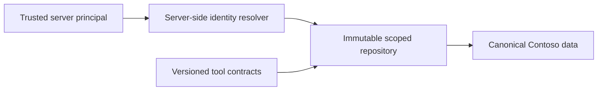

# Shared Toolbox contracts

> **Takeaway:** the model chooses which business operation to perform, but it
> never chooses who the caller is or which rows that caller may see.

The repository defines framework-neutral tool contracts across catalog,
customer, HR, operations, orders, support, and travel.
Each contract is versioned YAML with a JSON Schema parameter block, so the same
source can later be exposed through [Microsoft Foundry
Toolbox](https://learn.microsoft.com/azure/foundry/agents/concepts/toolbox-overview),
MCP, or an agent SDK without redefining authorization rules.

Here, Toolbox means shared Python code and contracts over generated SQLite,
not a deployed Microsoft Foundry Toolbox service or one central HTTP database.
Travel exposes its allow-listed operations over OpenAPI; the other specialist
runtimes bind the library in-process.



## Security invariants

- Scope comes from the server-selected immutable principal. Demo runtimes bind
  fixed fixtures; they do not demonstrate delegated end-user authorization.
- Tool schemas expose business filters, never identity, tenant, role, scope, or
  impersonation parameters.
- Unknown identities fail before a tool can execute.
- Lists, counts, schema descriptions, hierarchy walks, and aggregates all use
  the same scoped repository.
- HR aggregates suppress cohorts below the configured minimum.
- Global catalog data stays global, while stock, orders, customers, employees,
  support cases, bookings, and work orders inherit a declared regional scope.
- Travel name resolution projects only route-linked endpoint labels; it does
  not make regional operational location records global.

These are application-layer controls for the SQLite demo. The site does not
claim database-native row-level security. A hosted implementation can preserve
the same contract over Azure SQL and add database security policies later.

## Demonstration

```bash
foundry toolbox validate
foundry toolbox smoke
```

The smoke run resolves two synthetic People Partners and asks the same roster
question. The EMEA and APAC results are disjoint, aggregates enforce minimum
cohort size, and an unknown principal is rejected before any tool exists to
call. A travel persona then uses the same canonical identity and customer
records to retrieve regional policy, routes, fares, and a simulated booking.

The smoke client records tool name, persona, argument names, and result count;
it never copies returned rows or credentials into its audit trail. Persistent
runtime audit and token validation are added with the hosted agent layer.

## Source and limitations

The scope pattern adapts the deterministic policy boundary proven in
[`ericchansen/agent-demo-hr`](https://github.com/ericchansen/agent-demo-hr).
Fabric is intentionally absent from v1. The data agent is replaced with
explicit scoped aggregate tools, keeping the authorization boundary testable
and avoiding a hidden capacity dependency.
