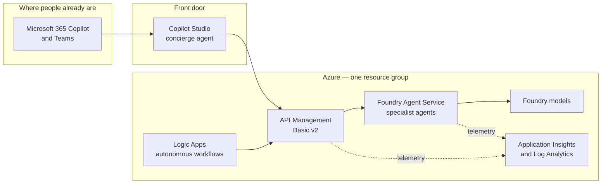

# Contoso Agent Platform

!!! info "What this is"
    Contoso is a **fictitious** company. This site documents how a demonstration
    multi-agent platform is designed, decided and governed on
    [Microsoft Foundry](https://learn.microsoft.com/azure/foundry/). Everything
    here is explanatory. **This site never calls an agent** and contains no
    tenant identifiers, endpoints or customer data.

## The 60-second version

Contoso wants employees to ask one assistant for help and have the right
specialist agent answer — without standing up a new portal, a new login, or a new
governance regime for every team that wants an agent.

The platform is four ideas:

1. **One front door.** People stay in Microsoft 365 Copilot and Teams. A
   [Microsoft Copilot Studio](https://learn.microsoft.com/microsoft-copilot-studio/fundamentals-what-is-copilot-studio)
   concierge agent is pinned tenant-wide and routes requests onward, so there is
   nothing new for anyone to learn or install.
2. **One brain per job.** Specialist agents are built on the
   [Foundry Agent Service](https://learn.microsoft.com/azure/foundry/agents/overview),
   which is generally available and provides threads, tools and evaluation
   without a bespoke orchestration layer.
3. **One governed edge.** Every call in and out passes through
   [API Management](https://learn.microsoft.com/azure/api-management/api-management-key-concepts),
   so authentication, rate limiting, and request logging are enforced in one
   place rather than re-implemented per agent.
4. **One blast radius.** Everything the project creates lives in a single Azure
   resource group. Deleting that group removes the whole platform. See
   [Ownership boundary](platform/boundaries.md).

## How the pieces fit

People talk to the concierge in Teams. The concierge calls specialist agents
through the gateway. Autonomous work — the things that should happen without
anybody asking — runs on Logic Apps and enters through the same gateway, so
scheduled work is governed identically to interactive work.

## What is decided, and how

Nothing on this site is asserted without evidence. Three decisions are made by
running a script against live Azure APIs rather than by opinion:

| Decision | How it is made | Result |
| --- | --- | --- |
| **Which region** | Candidate regions are eliminated against residency, reliability, latency, resource-type availability, published capability tables, live model availability and live quota — then ranked by cost, capacity, latency. | [Region selection](platform/regions.md) |
| **Whether it fits the budget** | Every line item is priced live against the [Azure Retail Prices API](https://learn.microsoft.com/rest/api/cost-management/retail-prices/azure-retail-prices) and CI fails above the ceiling. | [Cost model](platform/costs.md) |
| **What it is allowed to touch** | A machine-checked plan asserts every resource, identity, role assignment and teardown target is scoped inside one resource group. | [Ownership boundary](platform/boundaries.md) |

Re-run any of them yourself: see [Verification](operations/verification.md).

## Status

This is **Phase 0**: the decision and governance foundation. No Azure resources
have been provisioned yet. Components in public preview are labelled as such
wherever they appear — see [Sources](reference/sources.md) for every claim on
this site and the first-party page it comes from.
