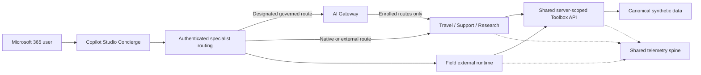

# Contoso Foundry

## One front door, specialist agents, one governed platform

Contoso Foundry is a reference architecture for composing role-specific agents
without creating isolated data, identity, telemetry, and governance stacks. A
Copilot Studio Concierge provides the conversational front door in Microsoft
365, then delegates bounded work to specialists with explicit service
contracts.

!!! info "Synthetic organization"
    Contoso is fictional. The data, identities, and business records in this
    repository are deterministic synthetic examples and contain no real
    customer or employee information.

## The design in one minute

### One front door

The [Concierge](agents/concierge.md) is a thin intent router in Copilot Studio.
It answers broad questions, collects consent, and hands bounded tasks to the
appropriate specialist. It does not absorb specialist prompts or business
logic.

### One brain per job

Each specialist uses the framework and hosting model that fit its responsibility:

- [Travel](agents/travel.md) uses the stable Foundry prompt-agent service.
- [Support](agents/contoso-support.md) uses Microsoft Agent Framework on
  **public-preview** hosted agents.
- [Research](agents/research.md) uses LangGraph on
  **public-preview** hosted agents.
- [Field](agents/field.md) uses Pydantic AI in Container Apps with
  **public-preview** external-agent registration.

The durable [eight-role roster](architecture/overview.md#eight-agent-roles) also
includes the Concierge, a contract-based HR specialist, and optional Approvals
and SRE coverage. Framework choice does not change identity, data, or
authorization policy.

### Shared data and tools

Every specialist works from the same
[canonical synthetic dataset](data/overview.md) through the same
[Toolbox API](data/toolbox.md). Toolbox derives identity and customer scope on
the server, validates typed inputs, and returns bounded results. Agents do not
trust prompts to choose authorization scope.

### Governed ingress where it is needed

The [AI Gateway](platform/ai-gateway.md) uses API Management to protect
designated model and custom-agent routes with authentication, quotas,
content-safety policy, correlation, and audit logging. It is not a universal
network choke point: native Foundry endpoints and external runtimes retain their
own platform identity and network boundaries.

### One telemetry spine

A shared [telemetry spine](platform/telemetry-spine.md) carries correlation from
the conversational entry point through Gateway, agent, and Toolbox activity.
Operators can trace a request end to end while preserving role-specific
reliability and cost attribution.

### Configurable cost governance

The [cost methodology](platform/costs.md) separates shared fixed resources,
workload-specific consumption, and explicit reserves for unpublished meters.
Retail-priced services are resolved from Microsoft's API, and each environment
sets its own policy ceiling in configuration.

### One Azure blast radius

All mutable Azure resources belong to one declared resource group. Boundary
validation prevents changes outside that scope and rejects diagnostics that
target undeclared workspaces. Power Platform remains a separate administrative
boundary with explicit authenticated connections into Azure.

## Explore the design

| Start here | What it explains |
| --- | --- |
| [Architecture overview](architecture/overview.md) | Core flows, hosting taxonomy, trust boundaries, and optional modules |
| [Data model](data/overview.md) | Shared synthetic business truth |
| [Toolbox](data/toolbox.md) | Typed tools, identity, and authorization scope |
| [AI Gateway](platform/ai-gateway.md) | Route-specific governance in API Management |
| [Agent catalog](agents/concierge.md) | Specialist roles and orchestration contracts |
| [Operations](operations/verification.md) | Deterministic verification and policy gates |
| [Cost methodology](platform/costs.md) | Attribution, live pricing, reserves, and configurable limits |
