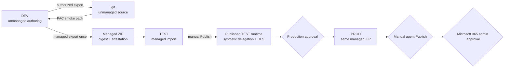

# Contoso Concierge ALM

> **Takeaway:** author unmanaged in DEV, build once, test the managed artifact in
> TEST, and promote that exact file to PROD only after approval. Import never
> publishes the runtime.

[Microsoft's Copilot Studio ALM guidance](https://learn.microsoft.com/microsoft-copilot-studio/guidance/alm)
recommends at least development, test, and production environments, custom
solutions, environment variables, connection references, and managed
downstream deployments. The repository encodes those rules in
`config/concierge/alm.yaml` and enforces them in
`tests/test_concierge_alm.py`.



## Release contract

The accepted version is `1.0.0.0`, producing
`ContosoConcierge_1_0_0_0_managed.zip`. The repository-local .NET tool manifest
pins PAC CLI `2.11.2`, and the contract job runs a real unmanaged `pac solution
pack` smoke gate. PAC cannot convert an unmanaged package into a managed package,
so the release path imports the complete unmanaged source to DEV and exports the
managed artifact from Dataverse. The workflow retains that artifact for 90 days.

The manually dispatched `Contoso Concierge ALM` workflow has four operations:

1. `package` requires a complete authorized DEV export, PAC-packs the unmanaged
   source, imports it to DEV, exports the managed ZIP once, validates its internal
   solution name, version, and managed state, attests it, and retains it.
2. `import-test` accepts only an artifact from a successful dispatch of this
   workflow on `main` at the operator-supplied exact SHA. It verifies the GitHub
   artifact archive digest and artifact attestation before validating and
   importing the managed ZIP. It does **not** create a PROD-eligible artifact.
3. `accept-test` runs only after an agent owner manually publishes the TEST
   runtime. Its protected harness exercises the synthetic Support delegation,
   EMEA/APAC row-scope separation, and unknown-principal denial. Only a complete
   pass reattests and uploads the TEST-accepted artifact.
4. `import-prod` accepts only the named TEST-accepted artifact, repeats the
   source-run, archive-digest, attestation, and internal-package checks, waits at
   the `concierge-prod-approval` GitHub environment, and imports the same bytes.

The [source-run metadata](https://docs.github.com/rest/actions/workflow-runs#get-a-workflow-run)
check rejects a different repository, workflow path, event,
branch, SHA, status, conclusion, artifact name, expired artifact, or artifact not
bound to that run. GitHub's download digest mismatch is only a warning, so the
workflow downloads the artifact archive from the API and enforces its recorded
SHA-256 itself before extracting it. The solution ZIP then must verify against a
[GitHub artifact attestation](https://docs.github.com/actions/concepts/security/artifact-attestations)
signed by this workflow.

The workflow intentionally omits `--publish-changes` and any Copilot Studio
Publish action. [Power Platform CLI's solution
commands](https://learn.microsoft.com/power-platform/developer/cli/reference/solution)
support packing, settings generation, and settings-aware import. Agent runtime
publishing and tenant availability remain separate manual steps.

## TEST runtime acceptance contract

`config/concierge/delegation-tests.yaml` is sent only to a protected HTTPS TEST
harness. Each request contains a synthetic test ID, prompt, and canonical
synthetic `oid`/`tid`. The harness returns the selected specialist, tool and
arguments, plus synthetic result rows or a fail-closed error. CI compares those
fields with the repository contract and prints only case IDs and pass/fail
status; it does not retain response bodies, screenshots, KQL, transcripts, or
telemetry artifacts.

The `concierge-test-acceptance` GitHub environment stores the harness URL and
bearer token. If that environment, the TEST runtime, or its secrets do not exist,
acceptance fails and no TEST-accepted artifact is uploaded. This is the expected
blocked behavior in the current tenant state.

## Supported rollback

Plainly importing an older managed ZIP is not the rollback procedure. The
supported path uses
[**Redeploy**](https://learn.microsoft.com/power-platform/alm/redeploy-past-solution-versions)
from a previous successful Power Platform Pipeline deployment after enabling
**Allow redeployments of older versions** and confirming the pipeline host
package meets Microsoft's minimum version.

Microsoft warns that redeployment irreversibly overwrites the current version,
removes newer components, and can destroy data. Before approval, an authorized
administrator must take and validate a target-environment backup, inventory
tables and data introduced since the selected deployment, and explicitly accept
the destructive-data impact. If that evidence is incomplete, use a forward fix;
use controlled uninstall/reinstall only when dependency and data ownership
checks prove it safe. Never substitute an arbitrary old ZIP import.

## Protected configuration

The DEV, TEST, and PROD examples under `deployment/concierge/` contain
placeholders only. At
deployment time the protected environment supplies:

- the target Power Platform environment URL and service-principal
  authentication;
- the Foundry specialist gateway base URL;
- the custom connector ID and target connection ID; and
- the complete deployment-settings file as a protected secret.

The Application Insights connection string is never a solution environment
variable. Microsoft's ALM guidance lists agent Application Insights,
authentication, channel, and sharing settings as not solution-aware, so an
authorized operator configures them after import from the protected secret
store.

## Telemetry privacy gates

| Environment | Environment export | Agent telemetry | Transcripts |
| --- | --- | --- | --- |
| DEV | **Public preview**, synthetic only | Off | Off |
| TEST | **Public preview**, synthetic only | Off | Off |
| PROD | Off | On, conversation and sensitive details off | Off |

DEV and TEST point to the shared project-owned Application Insights component.
No human is allowed to test there while environment-level export is enabled.
PROD uses agent-level telemetry with prompt, user, tool-input, and tool-output
detail disabled. Transcript saving is disabled in all three environments;
Microsoft notes that records can continue for up to 24 hours after the setting
is turned off, so the acceptance checklist waits through that window before any
production session.

## Roles and capacity

- **Authoring:** environment access, Environment Maker, and the Microsoft Copilot
  Studio User license.
- **Environment settings:** Environment Administrator.
- **Pipeline administration:** Deployment Pipeline Administrator or Power
  Platform Administrator, according to the chosen host.
- **Tenant availability:** Microsoft 365 administrator.
- **Copilot Credits:** Power Platform administrator or another account authorized
  for capacity management.

Capacity is a hard gate. The source of truth is the Power Platform admin center
or an authorized capacity API result showing credits allocated to PROD. Unknown,
forbidden, or empty evidence fails the gate.

## Current blocked state

The current operator has Global Reader, a read-only Microsoft Entra role. The
Power Platform environment inventory is empty, and capacity API calls are
forbidden. No environment, solution, connector, agent, channel, telemetry
setting, capacity allocation, or publication was created or attempted.

An authorized administrator must create DEV, TEST, and PROD, verify and allocate
capacity, create the connector and protected connections, run the first DEV
export, configure telemetry, and perform the publication approvals. There is no
supported read-only shortcut and this runbook does not suggest privilege
escalation.

## Local gates

```bash
ruff check .
pytest
dotnet tool restore
pwsh -File scripts/concierge-alm.ps1 -Operation Pack -ArtifactPath concierge-smoke.zip
foundry boundary --no-live
foundry costs
mkdocs build --strict
foundry scan site
```

The repository tests verify PAC-compatible solution metadata, version pinning,
source-run trust, attestation and archive-digest enforcement, internal managed
package validation, TEST runtime acceptance, same-artifact promotion,
placeholder-only settings, privacy posture, manual publication, supported
rollback, and teardown completeness without contacting Microsoft services.
