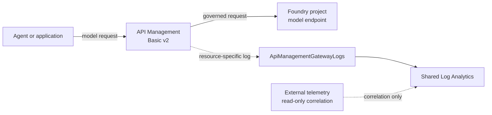

# AI gateway

> **Takeaway:** clients send model requests through one project-owned API
> Management gateway; request logs flow separately to the shared telemetry spine.

The gateway uses one Basic v2 unit in North Central US and a system-assigned
managed identity. The identity is project-owned and is the future authentication
boundary for Foundry model backends; no backend key is stored in the repository.
Basic v2 is the least expensive v2 tier with an SLA and is already included in
the [cost model](costs.md).

The API Management diagnostic setting sends the `GatewayLogs` category to the
project's Log Analytics workspace with the destination type set to `Dedicated`.
That combination produces the resource-specific
[`ApiManagementGatewayLogs`](https://learn.microsoft.com/azure/azure-monitor/reference/tables/apimanagementgatewaylogs)
table instead of the legacy `AzureDiagnostics` table. Request and response
bodies are not enabled by this diagnostic setting.

The request path and the external telemetry path remain separate. API
Management governs traffic before it reaches a model. External telemetry can be
correlated in Log Analytics, but it does not bypass the gateway or become a
backend dependency.

## Deployment boundary

The gateway, its identity, and its diagnostic setting are deployed only inside
the project resource group. The diagnostic destination is the shared,
project-owned workspace from the [telemetry spine](telemetry-spine.md). No
subscription-wide identity or role assignment is created.

## Sources

- [Configure AI Gateway in Microsoft Foundry](https://learn.microsoft.com/azure/foundry/configuration/enable-ai-api-management-gateway-portal)
- [API Management v2 tiers](https://learn.microsoft.com/azure/api-management/v2-service-tiers-overview)
- [Monitor API Management](https://learn.microsoft.com/azure/api-management/api-management-howto-use-azure-monitor)
- [`ApiManagementGatewayLogs` schema](https://learn.microsoft.com/azure/azure-monitor/reference/tables/apimanagementgatewaylogs)
