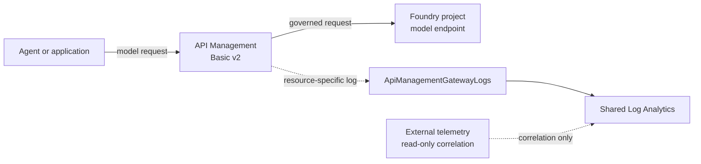

# AI gateway

> **Takeaway:** clients send model requests through one project-owned API
> Management gateway; request logs flow separately to the shared telemetry spine.



The gateway uses one Basic v2 unit in North Central US and a system-assigned
managed identity. The identity is project-owned and is the future authentication
boundary for Foundry model backends; no backend key is stored in the repository.
Basic v2 is the least expensive v2 tier with an SLA and is already included in
the [cost model](costs.md).

The API Management diagnostic setting sends the `GatewayLogs` category to the
project's Log Analytics workspace with the destination type set to `Dedicated`.
That combination produces the resource-specific
[`ApiManagementGatewayLogs`](https://learn.microsoft.com/azure/azure-monitor/reference/tables/apimanagementgatewaylogs)
table instead of the legacy `AzureDiagnostics` table. Request and response
bodies are not enabled by this diagnostic setting.

The request path and the external telemetry path remain separate. API
Management governs traffic before it reaches a model. External telemetry can be
correlated in Log Analytics, but it does not bypass the gateway or become a
backend dependency.

## Project enrollment and token governance

Each existing project has its own HTTPS API path, API Management subscription,
and Foundry `ApiManagement` connection. The connection key is generated and
passed between Azure resources only during deployment; it is never an output or
repository value. Reapplying `infra/gateway-association.bicep` reconciles the
same resources, so enrollment is idempotent.

Each connection can publish static `models` metadata supplied through the
`existingModelDeployments` deployment parameter. That input is an explicit
contract with the model-owning dependency stack: the gateway branch creates no
model deployments, and both root templates default to an empty array so a clean
deployment cannot advertise models that do not exist. The protected workflow
requires the operator to provide the JSON array for an environment that already
has deployments. Before what-if or deployment, it requires that input to match
the tracked expectation and the complete live deployment inventory, including
name, model, version, format, successful provisioning state, and responsible AI
policy attachment.

`expected_model_deployments` in `config/gateway.yaml` is used only for
fail-closed live verification. The verifier compares connection metadata with
the account's deployment names, model families, versions, formats, and
responsible AI policy attachments. Adding or replacing a deployment requires
updating that expected catalog and explicitly passing the matching deployment
input; an absent or stale deployment fails verification rather than producing a
false success.

| Project | Tokens/minute | Monthly token quota |
| --- | ---: | ---: |
| Travel | 20,000 | 2,000,000 |
| Support | 10,000 | 1,000,000 |
| Research | 10,000 | 1,000,000 |
| Platform | 5,000 | 500,000 |

These are safe demonstration defaults in `config/gateway.yaml`, not service
maximums. A configuration-only deployment adjusts them without changing Python
or Bicep. The `llm-token-limit` policy returns **429 Too Many Requests** for a
TPM overrun and **403 Forbidden** for a total-quota overrun.

New projects must be added to the same configuration before they receive an
independent route and counter. Until then, an account-level
`ai-gateway-default` connection is shared to every project and routes through a
conservative 2,000 TPM / 100,000 monthly-token policy. Existing named projects
keep their explicit routes and independent counters.

## Custom-agent readiness

`infra/policies/custom-agent.xml` is the route policy template for a future
registered custom agent. It requires:

- an APIM subscription key at the client-facing route;
- an Entra-only backend audience supplied as
  `CUSTOM_AGENT_ENTRA_RESOURCE`;
- API Management managed-identity authentication to that backend; and
- the same TPM and total-token quota controls.

The future backend must reject direct anonymous or key-based access before the
route is enabled. This branch intentionally does not deploy a custom agent or
claim that a not-yet-created backend is restricted.

## Logs and KQL

After a safe request reaches the gateway, operators can find it without reading
request or response bodies:

```kusto
ApiManagementGatewayLogs
| where TimeGenerated > ago(1h)
| project TimeGenerated, ApiId, OperationId, ResponseCode, TotalTime,
    BackendResponseCode, CorrelationId
| order by TimeGenerated desc
```

Quota responses can be isolated with:

```kusto
ApiManagementGatewayLogs
| where TimeGenerated > ago(1h)
| where ResponseCode in (403, 429)
| summarize Requests = count() by ResponseCode, ApiId, bin(TimeGenerated, 5m)
```

## Deployment boundary

The gateway, its identity, and its diagnostic setting are deployed only inside
the project resource group. The diagnostic destination is the shared,
project-owned workspace from the [telemetry spine](telemetry-spine.md). No
subscription-wide identity or role assignment is created.

## Live validation

After Azure login, the verifier checks the complete gateway control-plane
contract: APIM SKU and region, managed identity, diagnostic workspace and
resource-specific schema, connection targets and model metadata, token-fragment
XML and limits, every API's fragment/backend/managed-identity/forwarding policy,
the exact APIM API inventory, policy definitions and enforcement, live model
attachments, and every responsible AI filter. No API is exempted by a familiar
name or display label; a stock Echo API must be removed or governed explicitly:

```bash
foundry gateway verify
```

When an approved model is available, validate both limits through temporary,
independently keyed APIM routes: a TPM overrun must return 429 and a total-token
quota overrun must return 403. Query `ApiManagementGatewayLogs` for both records,
then remove the temporary APIs and subscriptions. Direct calls to the Foundry
backend are not gateway evidence.

## Sources

- [Configure AI Gateway in Microsoft Foundry](https://learn.microsoft.com/azure/foundry/configuration/enable-ai-api-management-gateway-portal)
- [AI Gateway model-discovery sample](https://github.com/Azure-Samples/AI-Gateway/tree/main/labs/model-routing-factory)
- [API Management v2 tiers](https://learn.microsoft.com/azure/api-management/v2-service-tiers-overview)
- [Monitor API Management](https://learn.microsoft.com/azure/api-management/api-management-howto-use-azure-monitor)
- [`ApiManagementGatewayLogs` schema](https://learn.microsoft.com/azure/azure-monitor/reference/tables/apimanagementgatewaylogs)
- [Limit LLM token usage](https://learn.microsoft.com/azure/api-management/llm-token-limit-policy)
- [Import a Microsoft Foundry API](https://learn.microsoft.com/azure/api-management/azure-ai-foundry-api)
