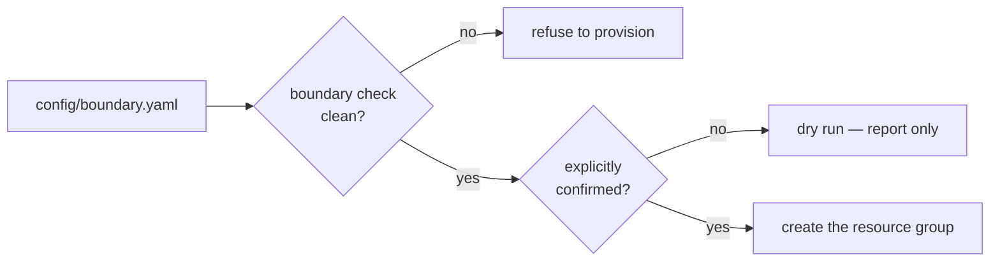

# Ownership boundary

This project runs inside a subscription it shares with other work. The rule that
makes that safe is simple:

!!! danger "The rule"
    Everything this project creates, assigns or deletes lives inside **one
    resource group**. Everything else in the subscription is read-only.

`foundry boundary` enforces it mechanically, and refuses to create the resource
group if any check fails.

## Why a check instead of a convention

A convention holds until someone is in a hurry. Three failure modes are worth
designing against specifically:

- **Adopting someone else's resource group** because the name looked right.
- **Granting a role at subscription scope** because it was easier than working
  out the right resource scope.
- **Writing diagnostics into a shared workspace** because one already existed.

Each is a one-line change, each is invisible in review, and each breaks the
promise that deleting one resource group removes the platform.

## What is checked

| Check | What it asserts |
| --- | --- |
| `plan:resource-group-name` | The plan targets the expected resource group, and its name is a valid Azure resource-group name. |
| `plan:relative-scopes` | Every scope is **relative** to the resource group. |
| `plan:no-reuse` | No identity is marked for reuse; every identity is created inside the boundary. |
| `plan:role-assignment-scopes` | No role assignment is scoped at subscription or management-group level. |
| `plan:teardown-completeness` | Every declared resource is covered by a teardown target. |
| `live:existing-resource-group` | The resource group either does not exist, or is empty and adoption is explicitly permitted. |
| `live:protected-resource-groups` | Every other resource group in the subscription is enumerated and recorded as read-only. |

## Relative scopes are the load-bearing idea

Scopes in `config/boundary.yaml` look like this:

```yaml
scope: providers/Microsoft.App/managedEnvironments/contoso-agents-env
```

They are rejected if they are absolute — that is, if they begin with a leading
slash, or contain a `subscriptions/` or `resourceGroups/` segment, or use `..`
to traverse upwards.

A relative scope **cannot name another subscription or resource group**. The
boundary is enforced by the shape of the data rather than by a reviewer noticing
a wrong GUID in a long string.

It has a second benefit: no subscription identifier appears in any tracked file.
The subscription is supplied by the environment at run time, so the repository
stays publishable.

## Provisioning is gated on the check

The helper that creates the resource group raises rather than proceeding if the
boundary report is not clean, and defaults to a dry run. There is no code path
that provisions first and validates afterwards.



## What lives outside the boundary

Two things the platform depends on are **not** in Azure and cannot be removed by
deleting the resource group:

- A dedicated **Power Platform environment**.
- The **Copilot Studio concierge agent** and any tenant-wide publication of it.

Both are tenant-scope objects shared with everyone else in the tenant, so this
project does not create them from automation. They are recorded in an explicit
external teardown inventory in `config/boundary.yaml` so that "delete the
resource group" is never mistaken for complete cleanup.

## Current state

The most recent run confirms the target resource group **does not yet exist**, so
the boundary is clean and no pre-existing resource is at risk of adoption. Phase 0
provisions nothing.

## Re-running it

```bash
foundry boundary              # plan checks plus live subscription checks
foundry boundary --no-live    # plan checks only; no Azure login required
```
