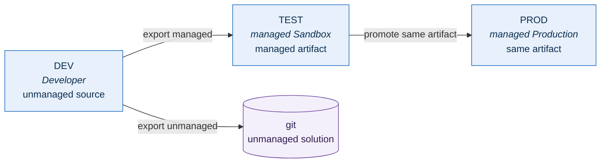

# Power Platform environments

Copilot Studio is where the conversational surface lives, and it does not run in
Azure. It runs in a Power Platform environment, metered against a separate
capacity pool, governed by a separate admin centre. That separation is the whole
reason this page exists: **none of it counts against the Azure budget, and none
of it is inside the resource group boundary.**

!!! warning "Nothing on this page has been provisioned"

    The tenant currently has **zero Power Platform environments**. Creating one
    is a tenant-scope action, which sits outside the single resource group this
    project is allowed to mutate — and the operator lacks the role to do it
    anyway (see below). So this is a runbook, not a record. It describes what to
    do and what to check — it does not claim it has been done.

## Blocked: the operator does not hold the required role

Environment creation is blocked today, and not for a technical reason.

The account driving this work holds **Global Reader**. Reading works — listing
environments returns `200` with an empty collection, which is how we know the
tenant has none. Writing does not, and the licensing and capacity APIs return
`403`. Global Reader is a read-only role by design, so this is the API behaving
correctly rather than a fault to work around.

Nothing on this page can proceed until someone holding **Global Administrator**
or **Power Platform Administrator** either performs the steps below or assigns
one of those roles to the operator. There is no read-only path to an
environment, and no supported way to self-elevate.

!!! danger "Acceptance gate"

    Tenant-wide publishing stays blocked until **both** hold:

    1. A Power Platform Administrator has created the environments below, and
    2. Copilot credit capacity has been read from the licensing API or PPAC by an
       account authorised to read it.

    A `403` is not a capacity reading. Until capacity has actually been observed,
    treat it as unknown — never as sufficient.

## Why three environments
Copilot Studio's application lifecycle is solution-based, and solutions only
move cleanly in one direction: unmanaged where you author, managed everywhere
else.

| Environment | Type | Holds |
| --- | --- | --- |
| `Contoso Agents DEV` | Developer | Unmanaged solution. The only place anyone authors |
| `Contoso Agents TEST` | Managed Sandbox | The managed artifact, imported |
| `Contoso Agents PROD` | Managed Production | The *same* managed artifact, promoted |

Two properties matter more than the table. The unmanaged solution is the source
of truth and lives in git, not in an environment. And TEST → PROD promotes the
identical artifact rather than rebuilding it, with environment-specific values
supplied through [deployment settings][settings] so that no human retypes a
connection reference into production.

Add Dataverse only where the chosen harness requires it. It is not free, it is
not trivially removable, and provisioning it "just in case" turns a reversible
decision into an irreversible one.

## Publishing is a manual gate, deliberately

This is the part that is easiest to get wrong, so it is worth stating plainly:

> **Importing and publishing a solution's customizations is not the same as
> publishing the agent.** A managed import makes the definition present in the
> environment. It does not put the agent in front of anyone.

Turning the agent on for real people is a separate action, and making it
available tenant-wide in Microsoft 365 Copilot and Teams needs a tenant
administrator to approve it. Both stay manual. An automated pipeline that could
silently expose an agent to every employee is a worse failure mode than a
pipeline that needs someone to press a button.

**Tenant-wide publishing stays blocked until capacity is verified.** Copilot
Studio meters in [credits][credits], drawn from a tenant pool, with defined
[overage enforcement][overage] when the pool runs dry. Verify the pool in the
Power Platform admin centre before publishing — not after, when the failure mode
is a degraded experience for everyone at once.

## Telemetry: the DEV/TEST and PROD split

Copilot Studio offers environment-level telemetry that captures conversations
in rich detail. It is genuinely useful for debugging, and it is not appropriate
for production, because [what it captures][envtel] includes user prompts, agent
replies, tool arguments, tool results and the identity of the user who typed
them — with **no documented way to suppress the content** while keeping the
rest.

So the split is:

| | DEV / TEST | PROD |
| --- | --- | --- |
| Environment-level rich telemetry | On, **public preview**, synthetic sessions only | **Off** |
| Agent-level Application Insights | Optional | On, with [conversation detail logging][agenttel] **off** |
| Dataverse transcript saving | **Off** | **Off** |
| Who appears in the data | Synthetic users only | Nobody's prompts |

The reason DEV and TEST can use the rich version is that the only people
talking to those agents are synthetic. Keep it that way: the moment a real
employee tests in DEV, the telemetry setting stops being a debugging convenience
and starts being a collection of their prompts.

## Teardown

Because none of this is in the resource group, deleting the resource group
removes none of it. The non-Azure teardown inventory is tracked in
`config/boundary.yaml` under `external_teardown` so that "how do we undo this"
has an answer written down before anything is created rather than after.

## Sources

- [Power Platform pipelines][settings] — promotion and deployment settings
- [Copilot Studio solutions overview][solutions] — managed vs unmanaged, and what import does
- [Environment-level agent telemetry][envtel] — what is captured
- [Agent-level telemetry][agenttel] — conversation detail logging
- [Copilot credits capacity][credits] — tenant capacity management
- [Overage enforcement][overage] — behaviour when capacity is exhausted

[settings]: https://learn.microsoft.com/power-platform/alm/pipelines
[solutions]: https://learn.microsoft.com/microsoft-copilot-studio/authoring-solutions-overview
[envtel]: https://learn.microsoft.com/microsoft-copilot-studio/advanced-environment-level-agent-telemetry
[agenttel]: https://learn.microsoft.com/microsoft-copilot-studio/advanced-bot-framework-composer-capture-telemetry
[credits]: https://learn.microsoft.com/power-platform/admin/manage-copilot-studio-copilot-credits-capacity
[overage]: https://learn.microsoft.com/microsoft-copilot-studio/requirements-messages-management#overage-enforcement
