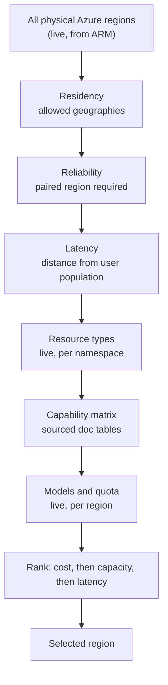

# Region selection

The deployment region is an **output**, not a preference. No region name is
hard-coded anywhere in this repository's logic. `foundry regions` starts from
every physical Azure region the subscription can see, removes candidates that
fail a hard requirement, and ranks the survivors.

## The process



Gates run cheapest-first so the expensive live probes only ever run against a
short list.

## What each gate tests

| Gate | Evidence | What it removes |
| --- | --- | --- |
| **Residency** | Live ARM region metadata | Regions outside the geographies the demo is permitted to store data in. |
| **Reliability** | Live ARM `pairedRegion` | Regions with no Azure paired region, so there is no documented geo-redundancy story. |
| **Latency** | Great-circle distance from the primary user population | Regions beyond the acceptable distance. |
| **Resource types** | Live `az provider show` per namespace | Regions where Container Apps, Application Insights, Log Analytics, API Management, Logic Apps or Foundry accounts cannot be created. |
| **Capability matrix** | Sourced documentation tables | Regions lacking [API Management Basic v2](https://learn.microsoft.com/azure/api-management/api-management-region-availability), [Azure SRE Agent](https://learn.microsoft.com/azure/sre-agent/supported-regions), [Foundry Agent Service](https://learn.microsoft.com/azure/foundry/agents/concepts/limits-quotas-regions), Logic Apps agent loops, or [Power Platform co-residency](https://learn.microsoft.com/microsoft-copilot-studio/data-location). |
| **Models** | Live `az cognitiveservices model list` | Regions where the required frontier chat model is not deployable. |
| **Quota** | Live `az cognitiveservices usage list` | Regions without enough remaining quota headroom to run the platform. |

Availability zones are recorded and reported but are **not** a hard gate.
API Management Basic v2 offers no zone redundancy and Container Apps consumption
workloads are single-region, so requiring zones would eliminate candidates for
resilience v1 cannot actually use. This is a deliberate, reversible choice
recorded in `config/region-requirements.yaml`; it should be raised to three zones
when the platform moves to a zone-redundant tier.

## Why the capability matrix exists

Most gates are answered by an API. Some capabilities Microsoft publishes only as
a documentation table — API Management v2 tier availability, SRE Agent regions,
Foundry Agent Service regions, Power Platform data locations. For those, and only
those, `config/capability-matrix.yaml` records the published list along with the
source URL and the date a human last checked it.

The alternative — trusting the resource provider's location list — is wrong in a
way that matters. `Microsoft.ApiManagement/service` reports many regions where
the **Basic v2 tier specifically** is unavailable, so a provider-only check would
select a region the platform cannot actually be built in.

Logic Apps agent loops are handled differently again: Microsoft publishes no
region table, and the documentation states the agent's model comes from Azure
OpenAI. The matrix therefore *derives* that capability from Foundry availability
rather than inventing a list.

## Ranking

Survivors are ranked **cost first, capacity second, latency third**.

Cost is a live comparison basket priced per region against the
[Azure Retail Prices API](https://learn.microsoft.com/rest/api/cost-management/retail-prices/azure-retail-prices).
The basket contains only components whose unit price actually varies by region.
Model inference is billed on global meters and does not discriminate between
regions, so including it would add noise without changing the ordering.

Capacity is remaining quota headroom, so a region that qualifies today but has no
room to grow ranks below one that does. Latency breaks the remaining ties.

## Result

The current run is published at
[`reports/region-selection.public.md`](https://github.com/ericchansen/microsoft-foundry/blob/main/reports/region-selection.public.md)
and regenerated by `foundry regions`.

The most recent run evaluated **63 candidate regions** and qualified **6**.
Elimination was dominated by residency, then by Azure SRE Agent availability,
then by reliability and resource-type gaps. Among the survivors several tie
exactly on the cost basket, so the selection is decided by capacity and latency —
which is the intended behaviour, not a degenerate case.

!!! note "Subscription-scoped numbers stay internal"
    Per-region quota limits and consumption are properties of a specific
    subscription. The full elimination trace including those numbers is written to
    `internal/region-selection.md`, which is excluded from this site and from
    version control. The published summary is sanitized.

## Re-running it

```bash
foundry regions
```

Requires a signed-in Azure CLI. See [Verification](../operations/verification.md).
