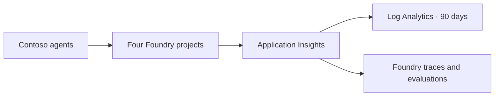

# One telemetry spine

> **Takeaway:** every telemetry-capable Contoso agent writes to one
> project-owned Application Insights resource, while each Foundry project keeps
> its own connection and identity.

The deployment creates one modern Microsoft Foundry account and four projects:
Travel, Support, Research, and Platform. Each project has a uniquely named
Application Insights connection that targets the same component. Unique
connection names are required because the service prevents two projects from
owning the same connection record.

The shared component is workspace-based and keeps logs for 90 days. This avoids
the cold-start problem created by one monitoring stack per short-lived demo:
traffic, failures, cost, and evaluation signals accumulate in one place over
time. Foundry uses [OpenTelemetry semantic conventions for generative
AI](https://opentelemetry.io/docs/specs/semconv/gen-ai/) and stores the traces in
[Application Insights](https://learn.microsoft.com/azure/foundry/observability/how-to/trace-agent-setup).

## Identity and access

Each project has its own system-assigned identity. The deployment grants every
project the following roles on both Application Insights and its linked Log
Analytics workspace:

- [Log Analytics
  Reader](https://learn.microsoft.com/azure/role-based-access-control/built-in-roles/monitor#log-analytics-reader)
  to query telemetry.
- [Privileged Monitoring Data
  Reader](https://learn.microsoft.com/azure/role-based-access-control/built-in-roles/monitor#privileged-monitoring-data-reader)
  to read protected generative-AI trace content when that content is enabled.

The Foundry account disables local authentication. Application Insights keeps
local ingestion enabled as a narrow compatibility exception because the current
project connection uses its connection string. The exception, credential, and
live resource identifiers never appear on this public site.

## Resources and controls

Everything is owned by the dedicated `rg-contoso-agents` boundary:

- one Foundry account and four child projects;
- one Log Analytics workspace and Application Insights component;
- RBAC-only Key Vault with purge protection;
- OAuth-default Storage with shared-key access disabled;
- Basic Azure Container Registry with admin access disabled;
- dedicated deployment and runtime managed identities;
- a monthly budget and alert group at 50%, 80%, and forecast 100%.

The complete deployment is declarative in Bicep. Current
`Microsoft.CognitiveServices/accounts/projects` and project connection APIs are
used directly, so no hidden portal creation step is required.

## Deployment and recovery

The first deployment exposed an important service rule: project connection
records need unique names even when they point to one shared resource. The
template therefore uses one connection name per project.

Two unchanged deployments succeeded after that correction, demonstrating
idempotence. The ownership check also attests the resource-group tags and live
resource inventory before any later deployment can adopt the group.

The public repository contains only the design and sanitized outcomes. Exact
resource IDs, principals, connection strings, and deployment evidence stay
under the unpublished `internal/` convention described on the
[ownership-boundary page](boundaries.md).

If a failed deployment leaves an obsolete App Insights connection, remove only
that project-owned connection after confirming its full resource ID is inside
the boundary. The next declarative deployment recreates the uniquely named
connection; never delete the shared monitoring resources as a recovery shortcut.

## Sources

- [Set up tracing in Microsoft
  Foundry](https://learn.microsoft.com/azure/foundry/observability/how-to/trace-agent-setup)
- [Application Insights connection Bicep
  sample](https://github.com/microsoft-foundry/foundry-samples/blob/main/infrastructure/infrastructure-setup-bicep/01-connections/connection-application-insights.bicep)
- [Microsoft Foundry RBAC
  roles](https://learn.microsoft.com/azure/foundry/concepts/rbac-foundry)
- [Azure Monitor data
  retention](https://learn.microsoft.com/azure/azure-monitor/logs/data-retention-configure)
